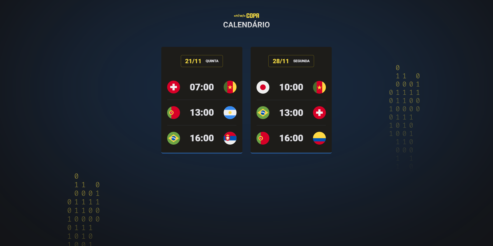

# NLW #10 Copa

Nlw (Next Level Week) e um evento feito pela [Rocketseat](https://www.rocketseat.com.br/) totalmente gratuito e com várias trilhas, a trilha escolhida e a Explorer mais focadas nos fundamentos do desenvolvimento web e o foco dessa edição era criar um calendário dos jogos da copa.


## Sumário 
- [Dúvidas](#dúvidas)
- [Tecnologias](#tecnologias)
- [Resultado final](#resultado-final)

## Dúvidas
### Como posso visualizar o projeto final?
Simples basta clicar aqui em [Visualizar projeto final](https://lfeli.github.io/Rocketseat-NLW-10-explorer-copa/) que você já será redirecionado.  

### Qual editor de código você utiliza?
Atualmente estou utilizando o **Visual Studio Code**.

### Quais são suas configs do VS CODE?
Segue as configs abaixo:
```json
{
    "workbench.iconTheme": "material-icon-theme",
    "workbench.colorTheme": "One Dark Pro Darker",
    "files.autoSave": "afterDelay",
    "editor.wordWrap": "on",
    "editor.fontSize": 16,
    "window.zoomLevel": -1
}
```

### Como troco minhas configs no VS CODE? (Windows)
Basta abrir o VS CODE e utilizar o seguinte comando ```CTRL``` + ```SHIFT``` + ```P```. Apos isso abrir ```"Open user settings (JSON)"``` e colar as configs.

(opcional)  
Caso seu Visual Studio Code não fique com os temas aplicados e necessario baixar os plugins "material icon theme" e o "one dark pro"

## Tecnologias
- HTML 5
- CSS 3
- Javascript
- Git

## Resultado final
Abaixo um gif do arquivo final pronto. Ou veja pessoalmente clicando [aqui](https://lfeli.github.io/Rocketseat-NLW-10-explorer-copa/).

